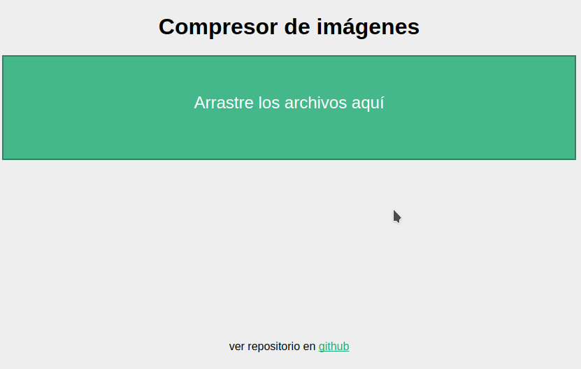
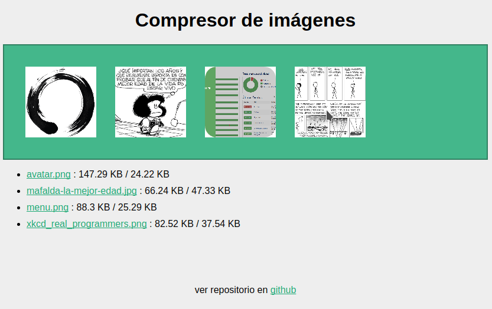

# Django-ODI

Clon de TinyJPG, TinyPNG implementado con motivos educativos

## Requerimientos python

* Django
* Pillow

## Requerimientos del sistema operativo

* Python 2 o Python 3
* pngquant: https://pngquant.org/
* mozjpeg: https://github.com/mozilla/mozjpeg
* ImageMagic: https://www.imagemagick.org/script/convert.php

## Screenshots

